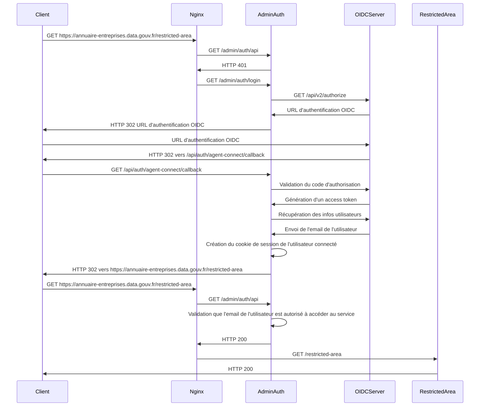

# Annuaire des Entreprises

Projet permettant de limiter les accès à des zones restreintes aux seuls utilisateurs authentifiés via OIDC et dont l'email fait partie d'une liste de mails autorisés.

## Liste des URI

| URI                               | Description                                                                                                   |
| --------------------------------- | ------------------------------------------------------------------------------------------------------------- |
| /admin/auth/api                   | Vérifie si l'utilisateur est authentifié et est connecté, redirige vers `/admin/auth/login` si non connecté   |
| /admin/auth/login                 | Redirige l'utilisateur vers la page d'authorization du serveur OIDC                                           |
| /api/auth/agent-connect/callback  | URL sur laquelle l'utilisateur est redirigé par le serveur OIDC afin de finaliser la création de la session   |
| /admin/auth/logout-callback       | Supprime la session                                                                                           |


## Usage avec Nginx

Le module NGINX `http auth request` est utilisé pour protéger les accès aux pages restreintes.

Exemple de protection de l'ensemble des accès à kibana (hors assets).

```
  location / {
    auth_request /admin/auth/api;

    proxy_pass   http://kibana:5601;
    proxy_set_header Host $host;
  }

  location ~* ^/(translations|ui)/ {
    proxy_pass   http://kibana:5601;
    proxy_set_header Host $host;
  }

  location ~* \.(js|jpg|png|css|svg|woff2|ico)$ {
    proxy_pass   http://kibana:5601;
    proxy_set_header Host $host;
  }

  # HTTP 401 returned by /admin/auth/api are served as HTTP 302
  error_page 401 =302 /admin/auth/login;

  # Check if the user is authenticated
  location = /admin/auth/api {
    internal;
    proxy_pass              http://auth:3000;
    proxy_pass_request_body off;
    proxy_set_header        Content-Length "";
    proxy_set_header        X-Original-URI $request_uri;
  }

  # Login page
  location = /admin/auth/login {
    proxy_pass              http://auth:3000;
    proxy_pass_request_body off;
    proxy_set_header        Content-Length "";
    proxy_set_header        X-Original-URI $request_uri;
  }

  location ~ /admin/auth {
    proxy_pass              http://auth:3000;
  }

  location ~ /api/auth/agent-connect {
    proxy_pass              http://auth:3000;
  }
```

Workflow correspondant à la configuration Nginx ci-dessus



## Variables d'environnement

| Variable                          | Default                                   | Description                                                                                   |
| --------------------------------- | ----------------------------------------- | --------------------------------------------------------------------------------------------- |
| PORT                              | 3000                                      | Port d'écoute                                                                                 |
| AUTHORIZED_USER_EMAILS CSV        |                                           | Liste des emails ayant accès à la zone protégée (sensible à la casse)                         |
 AUTHORIZED_SIRET                   |                                           | Lorsque défini : restreint les accès aux seuls utilisateurs dont le SIRET de correspond       |
| IRON_SESSION_PWD                  |                                           | Mot de passe de protection du cookie de session (au moins 32 caractères)                      |
| OPENID_CLIENT_ID                  |                                           |                                                                                               |
| OPENID_CLIENT_SECRET              |                                           |                                                                                               |
| OPENID_URL_DISCOVER               |                                           |                                                                                               |
| OPENID_REDIRECT_URI               |                                           |                                                                                               |
| OPENID_POST_LOGOUT_REDIRECT_URI   |                                           |                                                                                               |
| VERIFY_BROWSER_SIGNATURE          | 1                                         | Déconnecte automatiquement l'utilisateur si son navigateur a changé                           |
| VERIFY_IP_ADDRESS                 | 1                                         | Déconnecte automatiquement l'utilisateur si son adresse IP a changée                          |
| AUTH_COOKIE_NAME                  | annuaire-entreprises-admin-auth-session   | Nom du cookie de session                                                                      |
| AUTH_COOKIE_DOMAIN                | localhost                                 | @see: https://developer.mozilla.org/en-US/docs/Web/HTTP/Headers/Set-Cookie#domaindomain-value |
| AUTH_COOKIE_TTL                   | 3600                                      | @see: https://developer.mozilla.org/en-US/docs/Web/HTTP/Headers/Set-Cookie#max-agenumber      |

## Makefile

| Target                        | Description                                                   |
| ----------------------------- | ------------------------------------------------------------- |
| npm_install                   | Installation des dépendances NPM                              |
| demo_gen_ssl_certificates     | Génération des certificats SSL auto-signés pour la démo       |
| demo_run                      | Lancement de la stack de démo (nécessite docker compose v2)   |

## Demo

Procédure pour protéger les accès à `www.domaine_a_remplacer.fr`

1. Créer le fichier `.env` à partir de `.env.dist`
2. Ajouter dans `/etc/hosts` : `127.0.0.1 www.domaine_a_remplacer.fr`
3. Exécuter `make demo_run`
4. Accédeder à `https://www.domaine_a_remplacer.fr`

## Licence

Le code source de ce dépôt est publié sous [licence MIT](LICENSE) par la Direction interministérielle du numérique.
